```mermaid
graph TD
    subgraph "Phase 1: Initial Contact & Trust Building"
        A[Start] --> B[Develop Rapport]
        B --> C[Build Trust]
        C --> D[Establish Regular Contact]
        D --> E[Create Dependency]
        
        %% Initial Research & Planning
        A1[Research Target Background] --> A
        A2[Select Approach Method] --> A
        A3[Plan Timeline/Phases] --> A
        A4[Prepare Backstory] --> A
        A5[Map Social Network] --> A
        A6[Identify Vulnerabilities] --> A
        A7[Study Interests/Hobbies] --> A
        A8[Monitor Online Presence] --> A

        %% Detailed Rapport Building
        B1[Mirror Body Language/Tone] --> B
        B2[Share Calculated Stories] --> B
        B3[Find Common Struggles] --> B
        B4[Show Strategic Vulnerability] --> B
        B5[Practice Active Listening] --> B
        B6[Validate Deep Feelings] --> B
        B7[Match Communication Style] --> B
        B8[Create Shared Experiences] --> B
        
        %% Enhanced Trust Building
        C1[Demonstrate Consistent Reliability] --> C
        C2[Offer Strategic Help] --> C
        C3[Show Deep Understanding] --> C
        C4[Create Intimate Secrets] --> C
        C5[Provide Unique Solutions] --> C
        C6[Be Available At Key Times] --> C
        C7[Build Exclusive Bond] --> C
        C8[Become Essential Support] --> C

        %% Strategic Contact Management
        D1[Schedule Regular Updates] --> D
        D2[Give Focused Attention] --> D
        D3[Provide Crisis Support] --> D
        D4[Create Significant Memories] --> D
        D5[Plan Future Together] --> D
        D6[Share Important Moments] --> D
        D7[Establish Daily Routines] --> D
        D8[Maintain Constant Presence] --> D

        %% Advanced Dependency Creation
        E1[Become Emotional Anchor] --> E
        E2[Be Primary Problem Solver] --> E
        E3[Control Key Resources] --> E
        E4[Manage Daily Schedule] --> E
        E5[Guide Major Decisions] --> E
        E6[Merge Personal Identity] --> E
        E7[Create Financial Ties] --> E
        E8[Isolate From Others] --> E

        %% Cross-Connections Phase 1
        B -- "Trust Development" --> C
        C -- "Regular Interaction" --> D
        D -- "Emotional Investment" --> E
        
        B1 -- "Behavioral Sync" --> C1
        B4 -- "Emotional Opening" --> C4
        C2 -- "Support Pattern" --> D3
        C6 -- "Time Control" --> D7
        D5 -- "Future Control" --> E5
        D6 -- "Memory Leverage" --> E1
    end

    subgraph "Phase 2: Psychological Weakening"
        E --> F[Lower Self-Esteem]
        F --> G[Create Self-Doubt]
        G --> H[Erode Decision-Making]
        H --> I[Increase Vulnerability]
        
        %% Enhanced Self-Esteem Attacks
        F1[Use Subtle Personal Criticism] --> F
        F2[Make Strategic Comparisons] --> F
        F3[Downplay Achievements] --> F
        F4[Question Core Abilities] --> F
        F5[Point Out Perceived Flaws] --> F
        F6[Undermine Confidence Systematically] --> F
        F7[Create Impossible Standards] --> F
        F8[Withhold Positive Feedback] --> F

        %% Advanced Doubt Implementation
        G1[Question Memory Accuracy] --> G
        G2[Challenge Reality Perception] --> G
        G3[Rewrite Shared History] --> G
        G4[Deny Recorded Events] --> G
        G5[Create Deliberate Confusion] --> G
        G6[Plant Seeds of Uncertainty] --> G
        G7[Manipulate Facts Subtly] --> G
        G8[Contradict Known Truths] --> G

        %% Strategic Decision Erosion
        H1[Present Overwhelming Options] --> H
        H2[Create Artificial Time Pressure] --> H
        H3[Impose Strict Deadlines] --> H
        H4[Introduce Complex Problems] --> H
        H5[Design No-Win Scenarios] --> H
        H6[Fabricate Consequences] --> H
        H7[Complicate Simple Choices] --> H
        H8[Remove Decision Autonomy] --> H

        %% Systematic Vulnerability Creation
        I1[Cut Off Support Systems] --> I
        I2[Foster Complete Dependence] --> I
        I3[Control Essential Resources] --> I
        I4[Induce Emotional Exhaustion] --> I
        I5[Create Physical Fatigue] --> I
        I6[Cause Mental Strain] --> I
        I7[Exploit Personal Weaknesses] --> I
        I8[Eliminate Safe Spaces] --> I

        %% Cross-Connections Phase 2
        F -- "Confidence Destruction" --> G
        G -- "Reality Distortion" --> H
        H -- "Control Establishment" --> I

        F1 -- "Criticism Impact" --> G1
        F3 -- "Achievement Doubt" --> G3
        G2 -- "Reality Question" --> H1
        G6 -- "Uncertainty Effect" --> H5
        H4 -- "Problem Overwhelm" --> I4
        H8 -- "Autonomy Loss" --> I2
    end

    subgraph "Phase 3: Thought Implementation"
        I --> J[Plant Ideas]
        J --> K[Repeat Messages]
        K --> L[Reinforce Beliefs]
        L --> M[Create Associations]
        
        %% Advanced Idea Planting
        J1[Drop Subtle Suggestions] --> J
        J2[Share Manipulated Stories] --> J
        J3[Introduce Third Party Views] --> J
        J4[Use Leading Questions] --> J
        J5[Plant Indirect Hints] --> J
        J6[Present Future Scenarios] --> J
        J7[Create False Memories] --> J
        J8[Reframe Past Events] --> J

        %% Strategic Message Reinforcement
        K1[Schedule Daily Reminders] --> K
        K2[Provide Social Validation] --> K
        K3[Reference Authority Figures] --> K
        K4[Control Media Exposure] --> K
        K5[Apply Peer Pressure] --> K
        K6[Place Environmental Triggers] --> K
        K7[Use Multiple Channels] --> K
        K8[Create Echo Chambers] --> K

        %% Systematic Belief Reinforcement
        L1[Reward Desired Alignment] --> L
        L2[Punish Any Deviation] --> L
        L3[Manufacture Evidence] --> L
        L4[Orchestrate Social Proof] --> L
        L5[Connect to Identity] --> L
        L6[Create Future Stakes] --> L
        L7[Build Emotional Investment] --> L
        L8[Establish Dependency Patterns] --> L

        %% Complex Association Building
        M1[Create Emotional Anchors] --> M
        M2[Install Memory Triggers] --> M
        M3[Design Physical Cues] --> M
        M4[Strengthen Social Bonds] --> M
        M5[Link to Core Values] --> M
        M6[Merge Identity Aspects] --> M
        M7[Build Behavioral Patterns] --> M
        M8[Establish Control Mechanisms] --> M

        %% Cross-Connections Phase 3
        J -- "Idea Acceptance" --> K
        K -- "Message Integration" --> L
        L -- "Belief Solidification" --> M

        J1 -- "Suggestion Impact" --> K1
        J3 -- "External Validation" --> K3
        K2 -- "Social Reinforcement" --> L4
        K6 -- "Environmental Control" --> L7
        L5 -- "Identity Fusion" --> M6
        L8 -- "Control Pattern" --> M8
    end

    subgraph "Phase 4: Consolidation"
        M --> N[Monitor Changes]
        N --> O[Strengthen Control]
        O --> P[Remove Opposition]
        P --> Q[Complete Integration]
        
        %% Advanced Change Monitoring
        N1[Document Behavioral Shifts] --> N
        N2[Analyze Speech Patterns] --> N
        N3[Track Decision Changes] --> N
        N4[Monitor Emotional States] --> N
        N5[Test Loyalty Levels] --> N
        N6[Evaluate Belief Systems] --> N
        N7[Assess Social Changes] --> N
        N8[Measure Dependency Depth] --> N

        %% Strategic Control Strengthening
        O1[Deepen Social Isolation] --> O
        O2[Intensify Dependence] --> O
        O3[Expand Control Areas] --> O
        O4[Restrict Life Options] --> O
        O5[Instill Deep Fear] --> O
        O6[Build Invisible Barriers] --> O
        O7[Create Total Reliance] --> O
        O8[Eliminate Alternatives] --> O

        %% Systematic Opposition Removal
        P1[Discredit Support System] --> P
        P2[Block Resource Access] --> P
        P3[Generate Active Conflicts] --> P
        P4[Distort External Facts] --> P
        P5[Apply Strategic Pressure] --> P
        P6[Force Critical Choices] --> P
        P7[Eliminate Escape Routes] --> P
        P8[Destroy Safety Networks] --> P

        %% Complete Integration Process
        Q1[Achieve Total Isolation] --> Q
        Q2[Establish Full Dependence] --> Q
        Q3[Complete Identity Merger] --> Q
        Q4[Control Reality Perception] --> Q
        Q5[Secure Future Compliance] --> Q
        Q6[Create Permanent Bonds] --> Q
        Q7[Remove All Autonomy] --> Q
        Q8[Lock Control Pattern] --> Q

        %% Cross-Connections Phase 4
        N -- "Pattern Recognition" --> O
        O -- "Control Enhancement" --> P
        P -- "Opposition Elimination" --> Q

        N1 -- "Behavior Control" --> O2
        N5 -- "Loyalty Verification" --> O7
        O3 -- "Control Expansion" --> P2
        O5 -- "Fear Utilization" --> P6
        P4 -- "Reality Control" --> Q4
        P7 -- "Escape Prevention" --> Q8
    end

    %% Enhanced Detection & Prevention
    subgraph "Enhanced Detection System"
        D1[Monitor Rapid Changes] --> Detection
        D2[Track Dependencies] --> Detection
        D3[Observe Identity Shifts] --> Detection
        D4[Note Reality Distortion] --> Detection
        D5[Watch Social Changes] --> Detection
        D6[Record Control Signs] --> Detection
        D7[Document Pressure] --> Detection
        D8[Identify Isolation] --> Detection
        Detection --> Alert[Warning System]
    end

    subgraph "Advanced Prevention Framework"
        Alert --> PR1[Establish Strong Boundaries]
        Alert --> PR2[Verify Information Sources]
        Alert --> PR3[Maintain Support Network]
        Alert --> PR4[Keep Detailed Records]
        Alert --> PR5[Trust Internal Signals]
        Alert --> PR6[Seek Professional Help]
        Alert --> PR7[Preserve Independence]
        Alert --> PR8[Create Safety Plans]
        
        PR1 --> Defense[Protection Strategy]
        PR2 --> Defense
        PR3 --> Defense
        PR4 --> Defense
        PR5 --> Defense
        PR6 --> Defense
        PR7 --> Defense
        PR8 --> Defense
    end

    %% Enhanced Cross-Phase Connections
    N -- "Monitoring Loop" --> F
    O -- "Control Reinforcement" --> I
    P -- "Isolation Completion" --> E
    Q -- "Integration Verification" --> M

    style N fill:#f66,stroke:#333,stroke-width:2px
    style Q fill:#f96,stroke:#333,stroke-width:2px
    style Alert fill:#90EE90,stroke:#333,stroke-width:2px
    style Defense fill:#90EE90,stroke:#333,stroke-width:2px

     %% Add descriptions
    classDef default fill:#f9f,stroke:#333,stroke-width:1px
    classDef critical fill:#f66,stroke:#333,stroke-width:2px
    classDef phase fill:#fff,stroke:#333,stroke-width:1px
```

# Basic Mind Control Process Flow

## Implementation Process

### Phase 1: Initial Contact & Trust Building
1. **Rapport Development**
   - Mirroring body language
   - Sharing personal stories
   - Finding common ground
   - Showing vulnerability
   - Active listening
   - Validating feelings

2. **Trust Establishment**
   - Demonstrating reliability
   - Offering timely help
   - Showing understanding
   - Creating shared secrets
   - Providing solutions
   - Being available

3. **Contact Management**
   - Regular check-ins
   - Special attention
   - crisis support
   - memory creation
   - future planning
   - shared activities

4. **Dependency Creation**
   - Emotional support
   - problem solving
   - resource control
   - time management
   - decision making
   - identity merging

### Phase 2: Psychological Weakening
1. **Self-Esteem Reduction**
   - Subtle criticism
   - comparison to others
   - minimizing success
   - questioning abilities
   - highlighting flaws
   - undermining confidence

2. **Decision-Making Impairment**
   - questioning memories
   - challenging reality
   - rewriting history
   - denying experiences
   - creating confusion
   - planting uncertainty

3. **Vulnerability Increase**
   - isolating support
   - creating dependence
   - controlling resources
   - emotional drain
   - physical exhaustion
   - mental fatigue

### Phase 3: Thought Implementation
1. **Idea Planting**
   - casual mentions
   - strategic stories
   - third party views
   - leading questions
   - indirect hints
   - future scenarios

2. **Message Reinforcement**
   - daily reminders
   - social proof
   - expert opinions
   - media content
   - group pressure
   - environmental cues

3. **Belief Strengthening**
   - reward alignment
   - punish deviation
   - create evidence
   - social validation
   - identity link
   - future stakes

4. **Association Building**
   - emotional links
   - memory anchors
   - physical triggers
   - social bonds
   - value connection
   - identity fusion

### Phase 4: Consolidation
1. **Behavioral Monitoring**
   - track behavior
   - note language
   - observe choices
   - record reactions
   - test loyalty
   - assess beliefs

2. **Belief Strengthening**
   - increase isolation
   - deepen dependence
   - expand control
   - limit options
   - create fear
   - build barriers

3. **Opposition Removal**
   - discredit others
   - block access
   - create conflict
   - manipulate facts
   - use leverage
   - force choices

4. **Final Integration**
   - complete isolation
   - total dependence
   - identity merger
   - reality control
   - future lock
   - permanent bonds

## Detection Framework

### Early Warning Signs
1. **Trust Building Indicators**
   - unusually rapid trust development
   - excessive interest display
   - quick emotional attachment
   - intense focus on weaknesses

2. **Behavioral Changes**
   - decision-making alterations
   - dependency increase
   - thought pattern shifts
   - belief system changes

### Advanced Detection
1. **Pattern Recognition**
   - manipulation attempt frequency
   - undermining consistency
   - isolation systematization
   - control behavior patterns

2. **Psychological Changes**
   - personality alterations
   - value system shifts
   - belief modifications
   - relationship changes

## Prevention Strategies

### Personal Protection
1. **Boundary Maintenance**
   - clear limit setting
   - independence preservation
   - change questioning
   - instinct trusting

2. **Mental Fortification**
   - self-awareness building
   - confidence strengthening
   - support network maintenance
   - experience documentation

### Support Systems
1. **External Validation**
   - reality checking
   - professional consultation
   - peer support utilization
   - family connection maintenance

2. **Documentation Methods**
   - detailed record keeping
   - behavioral change tracking
   - relationship pattern monitoring
   - manipulation attempt documentation

## Recovery Process

### Immediate Actions
1. **Recognition**
   - manipulation acknowledgment
   - reality acceptance
   - support seeking
   - documentation initiation

2. **Support Activation**
   - professional contact
   - ally information
   - safety establishment
   - distance creation

### Long-term Recovery
1. **Psychological Rebuilding**
   - self-trust restoration
   - confidence rebuilding
   - experience processing
   - resilience development

2. **Future Prevention**
   - warning sign learning
   - boundary strengthening
   - support network building
   - awareness maintenance 