```mermaid
graph TD
    subgraph "Phase 1: Reality Destabilization"
        A[Start] --> B[Question Reality]
        B --> C[Plant Uncertainty]
        C --> D[Create Confusion]
        D --> E[Establish Control Pattern]
        
        %% Initial Assessment & Planning
        A1[Study Target History] --> A
        A2[Identify Memory Patterns] --> A
        A3[Map Emotional Triggers] --> A
        A4[Analyze Support System] --> A
        A5[Document Daily Routines] --> A
        A6[Find Reality Anchors] --> A
        A7[Note Decision Patterns] --> A
        A8[Track Confidence Areas] --> A

        %% Reality Questioning Methods
        B1[Challenge Recent Events] --> B
        B2[Dispute Conversations] --> B
        B3[Reframe Past Actions] --> B
        B4[Question Perceptions] --> B
        B5[Deny Shared Experiences] --> B
        B6[Alter Timeline Details] --> B
        B7[Contradict Memories] --> B
        B8[Minimize Important Events] --> B
        
        %% Uncertainty Implementation
        C1[Create Doubt Scenarios] --> C
        C2[Mix Truth With Lies] --> C
        C3[Present False Evidence] --> C
        C4[Manipulate Environment] --> C
        C5[Change Small Details] --> C
        C6[Rearrange Objects] --> C
        C7[Modify Agreements] --> C
        C8[Distort Time Perception] --> C

        %% Confusion Generation
        D1[Provide Conflicting Info] --> D
        D2[Switch Conversation Topics] --> D
        D3[Create False Choices] --> D
        D4[Introduce Chaos] --> D
        D5[Overwhelm With Details] --> D
        D6[Change Rules Randomly] --> D
        D7[Mix Truth and Fiction] --> D
        D8[Blur Reality Lines] --> D

        %% Control Pattern Establishment
        E1[Monitor Reactions] --> E
        E2[Adjust Techniques] --> E
        E3[Reinforce Doubt] --> E
        E4[Create Dependencies] --> E
        E5[Establish Authority] --> E
        E6[Build False Trust] --> E
        E7[Maintain Inconsistency] --> E
        E8[Track Effectiveness] --> E

        %% Cross-Connections Phase 1
        B -- "Reality Erosion" --> C
        C -- "Doubt Creation" --> D
        D -- "Pattern Formation" --> E
        
        B1 -- "Memory Impact" --> C1
        B4 -- "Perception Shift" --> C4
        C2 -- "Truth Distortion" --> D1
        C6 -- "Environmental Control" --> D4
        D5 -- "Mental Overwhelm" --> E3
        D7 -- "Reality Blur" --> E7
    end

    subgraph "Phase 2: Emotional Manipulation"
        E --> F[Trigger Insecurity]
        F --> G[Amplify Emotions]
        G --> H[Create Dependence]
        H --> I[Establish Dominance]
        
        %% Insecurity Activation
        F1[Target Self-Doubt] --> F
        F2[Highlight Weaknesses] --> F
        F3[Compare to Others] --> F
        F4[Question Abilities] --> F
        F5[Undermine Confidence] --> F
        F6[Create Inadequacy] --> F
        F7[Exploit Vulnerabilities] --> F
        F8[Plant Self-Criticism] --> F

        %% Emotional Amplification
        G1[Intensify Reactions] --> G
        G2[Provoke Responses] --> G
        G3[Manipulate Feelings] --> G
        G4[Create Emotional Chaos] --> G
        G5[Trigger Past Trauma] --> G
        G6[Exploit Sensitivities] --> G
        G7[Induce Anxiety] --> G
        G8[Generate Guilt] --> G

        %% Dependency Creation
        H1[Isolate from Support] --> H
        H2[Control Resources] --> H
        H3[Create Emotional Need] --> H
        H4[Limit Independence] --> H
        H5[Foster Reliance] --> H
        H6[Remove Alternatives] --> H
        H7[Deepen Attachment] --> H
        H8[Establish Necessity] --> H

        %% Dominance Establishment
        I1[Assert Authority] --> I
        I2[Control Decisions] --> I
        I3[Demand Compliance] --> I
        I4[Punish Resistance] --> I
        I5[Reward Submission] --> I
        I6[Create Power Dynamic] --> I
        I7[Maintain Control] --> I
        I8[Enforce Rules] --> I

        %% Cross-Connections Phase 2
        F -- "Emotional Weakening" --> G
        G -- "Dependency Building" --> H
        H -- "Control Solidification" --> I

        F1 -- "Doubt Amplification" --> G1
        F5 -- "Confidence Erosion" --> G5
        G3 -- "Emotional Control" --> H3
        G7 -- "Anxiety Utilization" --> H7
        H4 -- "Independence Loss" --> I2
        H8 -- "Complete Reliance" --> I7
    end

    subgraph "Phase 3: Reality Reconstruction"
        I --> J[Rewrite History]
        J --> K[Install New Reality]
        K --> L[Reinforce Narrative]
        L --> M[Lock New Reality]
        
        %% History Rewriting
        J1[Change Past Events] --> J
        J2[Modify Memories] --> J
        J3[Alter Relationships] --> J
        J4[Reframe Experiences] --> J
        J5[Create False History] --> J
        J6[Distort Timeline] --> J
        J7[Replace Facts] --> J
        J8[Erase Evidence] --> J

        %% New Reality Installation
        K1[Present Alternative Facts] --> K
        K2[Create New Context] --> K
        K3[Build False Framework] --> K
        K4[Establish New Normal] --> K
        K5[Implement New Rules] --> K
        K6[Set New Standards] --> K
        K7[Define New Truth] --> K
        K8[Shape New Perspective] --> K

        %% Narrative Reinforcement
        L1[Repeat New Version] --> L
        L2[Validate New Reality] --> L
        L3[Confirm New Truth] --> L
        L4[Support New Context] --> L
        L5[Strengthen New Story] --> L
        L6[Reinforce Changes] --> L
        L7[Maintain New Normal] --> L
        L8[Solidify New Facts] --> L

        %% Reality Lock Implementation
        M1[Secure New Reality] --> M
        M2[Block Old Memories] --> M
        M3[Prevent Questioning] --> M
        M4[Control Information] --> M
        M5[Isolate Completely] --> M
        M6[Remove Contradictions] --> M
        M7[Establish Permanence] --> M
        M8[Lock New Framework] --> M

        %% Cross-Connections Phase 3
        J -- "History Alteration" --> K
        K -- "Reality Integration" --> L
        L -- "Framework Solidification" --> M

        J1 -- "Event Modification" --> K1
        J4 -- "Experience Reframe" --> K4
        K2 -- "Context Control" --> L2
        K6 -- "Standard Setting" --> L6
        L5 -- "Story Reinforcement" --> M5
        L8 -- "Fact Solidification" --> M8
    end

    subgraph "Phase 4: Control Maintenance"
        M --> N[Monitor Acceptance]
        N --> O[Strengthen Grip]
        O --> P[Eliminate Resistance]
        P --> Q[Complete Control]
        
        %% Acceptance Monitoring
        N1[Track Belief Level] --> N
        N2[Observe Behavior] --> N
        N3[Test Compliance] --> N
        N4[Check Reality Acceptance] --> N
        N5[Measure Resistance] --> N
        N6[Assess Integration] --> N
        N7[Monitor Reactions] --> N
        N8[Evaluate Stability] --> N

        %% Control Strengthening
        O1[Increase Dependence] --> O
        O2[Deepen Isolation] --> O
        O3[Expand Control Areas] --> O
        O4[Tighten Restrictions] --> O
        O5[Enhance Manipulation] --> O
        O6[Strengthen Bonds] --> O
        O7[Reinforce Authority] --> O
        O8[Perfect Techniques] --> O

        %% Resistance Elimination
        P1[Remove Doubts] --> P
        P2[Block Verification] --> P
        P3[Prevent Questions] --> P
        P4[Isolate Critics] --> P
        P5[Discredit Opposition] --> P
        P6[Eliminate Evidence] --> P
        P7[Suppress Truth] --> P
        P8[Control Information] --> P

        %% Complete Control Achievement
        Q1[Lock Reality Version] --> Q
        Q2[Secure Dependence] --> Q
        Q3[Maintain Isolation] --> Q
        Q4[Perfect Control] --> Q
        Q5[Ensure Compliance] --> Q
        Q6[Cement Authority] --> Q
        Q7[Establish Permanence] --> Q
        Q8[Complete Integration] --> Q

        %% Cross-Connections Phase 4
        N -- "Acceptance Verification" --> O
        O -- "Control Enhancement" --> P
        P -- "Resistance Removal" --> Q

        N1 -- "Belief Monitoring" --> O1
        N5 -- "Resistance Check" --> O5
        O3 -- "Control Expansion" --> P3
        O7 -- "Authority Reinforcement" --> P7
        P4 -- "Critic Isolation" --> Q3
        P8 -- "Information Control" --> Q4
    end

    %% Enhanced Detection & Prevention
    subgraph "Enhanced Detection System"
        D1[Notice Reality Distortion] --> Detection
        D2[Track Memory Conflicts] --> Detection
        D3[Monitor Emotional Changes] --> Detection
        D4[Observe Control Patterns] --> Detection
        D5[Document Inconsistencies] --> Detection
        D6[Record Manipulation] --> Detection
        D7[Note Isolation Signs] --> Detection
        D8[Watch Behavior Shifts] --> Detection
        Detection --> Alert[Warning System]
    end

    subgraph "Advanced Prevention Framework"
        Alert --> PR1[Document Everything]
        Alert --> PR2[Trust Your Memory]
        Alert --> PR3[Keep Support Network]
        Alert --> PR4[Maintain Independence]
        Alert --> PR5[Check External Reality]
        Alert --> PR6[Set Firm Boundaries]
        Alert --> PR7[Seek Outside Views]
        Alert --> PR8[Build Self-Trust]
        
        PR1 --> Defense[Protection Strategy]
        PR2 --> Defense
        PR3 --> Defense
        PR4 --> Defense
        PR5 --> Defense
        PR6 --> Defense
        PR7 --> Defense
        PR8 --> Defense
    end

    %% Enhanced Cross-Phase Connections
    N -- "Reality Check Loop" --> F
    O -- "Control Reinforcement" --> I
    P -- "Isolation Completion" --> E
    Q -- "Integration Verification" --> M

    style N fill:#f66,stroke:#333,stroke-width:2px
    style Q fill:#f96,stroke:#333,stroke-width:2px
    style Alert fill:#90EE90,stroke:#333,stroke-width:2px
    style Defense fill:#90EE90,stroke:#333,stroke-width:2px

    %% Add descriptions
    classDef default fill:#f9f,stroke:#333,stroke-width:1px
    classDef critical fill:#f66,stroke:#333,stroke-width:2px
    classDef phase fill:#fff,stroke:#333,stroke-width:1px
```

# Gaslighting Techniques and Prevention Analysis

## Implementation Methods

### Reality Distortion Techniques
1. **Environmental Manipulation**
   - Strategic object relocation
   - Room arrangement changes
   - Document modification
   - Evidence alteration

2. **Psychological Manipulation**
   - Memory distortion
   - Fact denial
   - Story revision
   - Truth manipulation

3. **Emotional Manipulation**
   - Confusion creation
   - Anxiety induction
   - Trust erosion
   - Reality questioning

### Advanced Implementation
1. **Memory Attacks**
   - Event denial
   - History revision
   - Experience questioning
   - Timeline manipulation

2. **Evidence Manipulation**
   - Document alteration
   - Proof destruction
   - Witness manipulation
   - Reality reconstruction

## Detection Strategies

### Early Warning Signs
1. **Personal Experience**
   - Reality questioning
   - Memory uncertainty
   - Decision paralysis
   - Trust erosion

2. **Behavioral Changes**
   - Excessive apologizing
   - Constant self-doubt
   - Reality checking
   - Validation seeking

### Advanced Recognition
1. **Pattern Identification**
   - Systematic denial
   - Reality distortion
   - Truth manipulation
   - Evidence tampering

2. **Relationship Dynamics**
   - Power imbalance
   - Control patterns
   - Trust destruction
   - Reality manipulation

## Prevention Methods

### Personal Protection
1. **Documentation**
   - Event recording
   - Photo evidence
   - Conversation logs
   - Timeline tracking

2. **Reality Anchoring**
   - External validation
   - Evidence preservation
   - Truth documentation
   - Memory protection

### Support Network
1. **Trust Circle**
   - Reliable witnesses
   - Support group
   - Professional help
   - Reality validators

2. **Information Security**
   - Evidence backup
   - Document protection
   - Communication records
   - Reality verification

## Recovery Process

### Immediate Steps
1. **Recognition**
   - Pattern identification
   - Manipulation acceptance
   - Reality restoration
   - Support activation

2. **Protection**
   - Boundary establishment
   - Evidence collection
   - Support mobilization
   - Reality anchoring

### Long-term Recovery
1. **Psychological Healing**
   - Trust rebuilding
   - Reality reconnection
   - Confidence restoration
   - Memory validation

2. **Future Prevention**
   - Pattern recognition
   - Boundary maintenance
   - Support network
   - Reality checking

## Impact Assessment

### Psychological Effects
1. **Cognitive Impact**
   - Memory disruption
   - Reality distortion
   - Decision impairment
   - Trust destruction

2. **Emotional Impact**
   - Anxiety development
   - Depression risk
   - Confidence loss
   - Reality disconnect

### Life Impact
1. **Relationship Effects**
   - Trust issues
   - Social isolation
   - Support loss
   - Reality questioning

2. **Functional Impact**
   - Decision paralysis
   - Reality uncertainty
   - Memory doubt
   - Truth confusion

## Intervention Strategies

### Professional Support
1. **Therapeutic Help**
   - Reality therapy
   - Trauma processing
   - Trust rebuilding
   - Memory validation

2. **Support Services**
   - Crisis intervention
   - Reality grounding
   - Evidence collection
   - Protection planning

### Self-Help Methods
1. **Reality Maintenance**
   - Documentation practice
   - Truth anchoring
   - Memory protection
   - Evidence collection

2. **Recovery Tools**
   - Reality checking
   - Support building
   - Boundary setting
   - Truth validation 
