```mermaid
graph TD
    subgraph "Phase 1: Connection Assessment & Initial Separation"
        A[Start] --> B[Map Connections]
        B --> C[Identify Targets]
        C --> D[Create Strategy]
        D --> E[Begin Separation]
        
        %% Network Mapping
        A1[Document Relationships] --> A
        A2[Analyze Support System] --> A
        A3[Identify Key Contacts] --> A
        A4[Map Daily Interactions] --> A
        A5[Track Communication Patterns] --> A
        A6[Note Resource Dependencies] --> A
        A7[Assess Emotional Bonds] --> A
        A8[Evaluate Social Influence] --> A

        %% Connection Analysis
        B1[List Close Family] --> B
        B2[Map Friend Circles] --> B
        B3[Track Professional Relations] --> B
        B4[Note Support Sources] --> B
        B5[Identify Mentors/Guides] --> B
        B6[Document Social Groups] --> B
        B7[Analyze Online Networks] --> B
        B8[Review Financial Ties] --> B
        
        %% Target Prioritization
        C1[Rank Relationship Strength] --> C
        C2[Assess Support Level] --> C
        C3[Evaluate Influence Power] --> C
        C4[Measure Resource Access] --> C
        C5[Check Information Flow] --> C
        C6[Rate Emotional Impact] --> C
        C7[Gauge Resistance Level] --> C
        C8[Determine Vulnerability] --> C

        %% Strategy Development
        D1[Plan Timing Sequence] --> D
        D2[Choose Initial Targets] --> D
        D3[Design Approach Methods] --> D
        D4[Create Cover Stories] --> D
        D5[Prepare Justifications] --> D
        D6[Develop Narratives] --> D
        D7[Set Action Timeline] --> D
        D8[Arrange Resources] --> D

        %% Initial Separation Actions
        E1[Start Small Conflicts] --> E
        E2[Plant Subtle Doubts] --> E
        E3[Create Misunderstandings] --> E
        E4[Introduce Tension] --> E
        E5[Manipulate Schedule] --> E
        E6[Reduce Contact Time] --> E
        E7[Control Communication] --> E
        E8[Limit Interactions] --> E

        %% Cross-Connections Phase 1
        B -- "Network Understanding" --> C
        C -- "Strategic Planning" --> D
        D -- "Implementation Start" --> E
        
        B1 -- "Family Assessment" --> C1
        B4 -- "Support Evaluation" --> C4
        C2 -- "Target Selection" --> D2
        C6 -- "Impact Planning" --> D6
        D5 -- "Story Creation" --> E3
        D7 -- "Time Control" --> E5
    end

    subgraph "Phase 2: Support System Disruption"
        E --> F[Weaken Bonds]
        F --> G[Create Conflicts]
        G --> H[Control Information]
        H --> I[Establish Barriers]
        
        %% Bond Weakening
        F1[Question Loyalty] --> F
        F2[Plant Suspicion] --> F
        F3[Highlight Differences] --> F
        F4[Exaggerate Problems] --> F
        F5[Minimize Positives] --> F
        F6[Create Distance] --> F
        F7[Reduce Trust] --> F
        F8[Erode Confidence] --> F

        %% Conflict Generation
        G1[Start Arguments] --> G
        G2[Manipulate Stories] --> G
        G3[Create Misunderstandings] --> G
        G4[Provoke Reactions] --> G
        G5[Amplify Issues] --> G
        G6[Trigger Sensitivities] --> G
        G7[Exploit Weaknesses] --> G
        G8[Foster Disagreements] --> G

        %% Information Control
        H1[Filter Communications] --> H
        H2[Distort Messages] --> H
        H3[Block Contact] --> H
        H4[Monitor Interactions] --> H
        H5[Manipulate Facts] --> H
        H6[Control Narrative] --> H
        H7[Restrict Information] --> H
        H8[Manage Perceptions] --> H

        %% Barrier Creation
        I1[Create Physical Distance] --> I
        I2[Impose Time Constraints] --> I
        I3[Build Social Obstacles] --> I
        I4[Establish Rules] --> I
        I5[Set Restrictions] --> I
        I6[Create Dependencies] --> I
        I7[Enforce Limitations] --> I
        I8[Maintain Separation] --> I

        %% Cross-Connections Phase 2
        F -- "Trust Erosion" --> G
        G -- "Communication Control" --> H
        H -- "Access Restriction" --> I

        F1 -- "Suspicion Creation" --> G1
        F5 -- "Relationship Damage" --> G5
        G3 -- "Message Control" --> H3
        G7 -- "Vulnerability Use" --> H7
        H4 -- "Contact Limitation" --> I4
        H8 -- "Perception Management" --> I8
    end

    subgraph "Phase 3: Dependency Creation"
        I --> J[Control Resources]
        J --> K[Create Needs]
        K --> L[Remove Alternatives]
        L --> M[Secure Dependence]
        
        %% Resource Control
        J1[Manage Finances] --> J
        J2[Control Transportation] --> J
        J3[Limit Communication Tools] --> J
        J4[Restrict Access] --> J
        J5[Monitor Resources] --> J
        J6[Create Scarcity] --> J
        J7[Regulate Usage] --> J
        J8[Maintain Control] --> J

        %% Need Creation
        K1[Generate Requirements] --> K
        K2[Create Obligations] --> K
        K3[Establish Routines] --> K
        K4[Build Reliance] --> K
        K5[Foster Attachment] --> K
        K6[Develop Habits] --> K
        K7[Instill Fear] --> K
        K8[Create Uncertainty] --> K

        %% Alternative Elimination
        L1[Remove Options] --> L
        L2[Block Solutions] --> L
        L3[Prevent Independence] --> L
        L4[Discourage Self-Reliance] --> L
        L5[Eliminate Choices] --> L
        L6[Restrict Freedom] --> L
        L7[Control Decisions] --> L
        L8[Limit Autonomy] --> L

        %% Dependence Consolidation
        M1[Reinforce Control] --> M
        M2[Strengthen Bonds] --> M
        M3[Deepen Reliance] --> M
        M4[Cement Position] --> M
        M5[Ensure Compliance] --> M
        M6[Lock Patterns] --> M
        M7[Secure Position] --> M
        M8[Maintain Power] --> M

        %% Cross-Connections Phase 3
        J -- "Need Establishment" --> K
        K -- "Option Removal" --> L
        L -- "Control Solidification" --> M

        J1 -- "Financial Control" --> K1
        J4 -- "Access Control" --> K4
        K2 -- "Obligation Creation" --> L2
        K6 -- "Habit Formation" --> L6
        L5 -- "Choice Elimination" --> M5
        L8 -- "Autonomy Reduction" --> M8
    end

    subgraph "Phase 4: Isolation Maintenance"
        M --> N[Monitor Isolation]
        N --> O[Reinforce Control]
        O --> P[Prevent Reconnection]
        P --> Q[Complete Isolation]
        
        %% Isolation Monitoring
        N1[Track Contacts] --> N
        N2[Assess Independence] --> N
        N3[Check Compliance] --> N
        N4[Monitor Behavior] --> N
        N5[Evaluate Resistance] --> N
        N6[Observe Patterns] --> N
        N7[Measure Control] --> N
        N8[Test Loyalty] --> N

        %% Control Reinforcement
        O1[Strengthen Barriers] --> O
        O2[Increase Dependence] --> O
        O3[Tighten Restrictions] --> O
        O4[Enhance Control] --> O
        O5[Perfect Methods] --> O
        O6[Adjust Tactics] --> O
        O7[Improve Effectiveness] --> O
        O8[Maintain Power] --> O

        %% Reconnection Prevention
        P1[Block New Contacts] --> P
        P2[Prevent Support] --> P
        P3[Control Environment] --> P
        P4[Maintain Distance] --> P
        P5[Discourage Independence] --> P
        P6[Monitor Activities] --> P
        P7[Restrict Freedom] --> P
        P8[Enforce Isolation] --> P

        %% Complete Isolation Achievement
        Q1[Ensure Total Control] --> Q
        Q2[Perfect Isolation] --> Q
        Q3[Lock Dependencies] --> Q
        Q4[Secure Position] --> Q
        Q5[Maintain Power] --> Q
        Q6[Control All Aspects] --> Q
        Q7[Prevent Escape] --> Q
        Q8[Complete Dominance] --> Q

        %% Cross-Connections Phase 4
        N -- "Control Assessment" --> O
        O -- "Isolation Enhancement" --> P
        P -- "Separation Reinforcement" --> E
        Q -- "Isolation Verification" --> M

        N1 -- "Contact Monitoring" --> O1
        N5 -- "Resistance Check" --> O5
        O3 -- "Restriction Increase" --> P3
        O7 -- "Method Improvement" --> P7
        P4 -- "Distance Maintenance" --> Q4
        P8 -- "Isolation Enforcement" --> Q8
    end

    %% Enhanced Detection & Prevention
    subgraph "Enhanced Detection System"
        D1[Notice Contact Reduction] --> Detection
        D2[Track Relationship Changes] --> Detection
        D3[Monitor Access Limits] --> Detection
        D4[Observe Control Patterns] --> Detection
        D5[Document Restrictions] --> Detection
        D6[Record Dependencies] --> Detection
        D7[Note Freedom Loss] --> Detection
        D8[Watch Behavior Changes] --> Detection
        Detection --> Alert[Warning System]
    end

    subgraph "Advanced Prevention Framework"
        Alert --> PR1[Maintain Connections]
        Alert --> PR2[Keep Independence]
        Alert --> PR3[Secure Resources]
        Alert --> PR4[Build Support Network]
        Alert --> PR5[Document Changes]
        Alert --> PR6[Preserve Freedom]
        Alert --> PR7[Resist Control]
        Alert --> PR8[Plan Escape Routes]
        
        PR1 --> Defense[Protection Strategy]
        PR2 --> Defense
        PR3 --> Defense
        PR4 --> Defense
        PR5 --> Defense
        PR6 --> Defense
        PR7 --> Defense
        PR8 --> Defense
    end

    %% Enhanced Cross-Phase Connections
    N -- "Connection Check" --> F
    O -- "Control Enhancement" --> I
    P -- "Separation Reinforcement" --> E
    Q -- "Isolation Verification" --> M

    style N fill:#f66,stroke:#333,stroke-width:2px
    style Q fill:#f96,stroke:#333,stroke-width:2px
    style Alert fill:#90EE90,stroke:#333,stroke-width:2px
    style Defense fill:#90EE90,stroke:#333,stroke-width:2px

    %% Add descriptions
    classDef default fill:#f9f,stroke:#333,stroke-width:1px
    classDef critical fill:#f66,stroke:#333,stroke-width:2px
    classDef phase fill:#fff,stroke:#333,stroke-width:1px
```

# Isolation Tactics Analysis

## Implementation Methods

### Initial Assessment Phase
1. **Network Mapping**
   - Family relationship analysis
   - Friend circle identification
   - Professional connection assessment
   - Support system evaluation

2. **Dependency Analysis**
   - Financial ties mapping
   - Emotional bond assessment
   - Social connection evaluation
   - Professional relationship review

### Social Isolation Techniques
1. **Relationship Disruption**
   - Support network criticism
   - Artificial conflict creation
   - Trust undermining
   - Relationship sabotage

2. **Time Control**
   - Schedule manipulation
   - Activity monitoring
   - Social event interference
   - Commitment creation

3. **Social Undermining**
   - Reputation damage
   - Relationship poisoning
   - Trust destruction
   - Support erosion

### Control Methods
1. **Financial Control**
   - Resource restriction
   - Employment interference
   - Asset manipulation
   - Expense monitoring

2. **Physical Control**
   - Movement restriction
   - Location monitoring
   - Environment control
   - Access limitation

3. **Information Control**
   - Communication monitoring
   - Media restriction
   - Narrative control
   - Reality manipulation

## Detection Framework

### Early Warning Signs
1. **Social Changes**
   - Relationship strain
   - Contact reduction
   - Activity limitation
   - Communication changes

2. **Control Indicators**
   - Financial restrictions
   - Movement limitations
   - Information filtering
   - Decision control

### Advanced Recognition
1. **Pattern Identification**
   - Systematic isolation
   - Control escalation
   - Dependency creation
   - Freedom reduction

2. **Impact Assessment**
   - Psychological effects
   - Social disruption
   - Financial control
   - Physical restriction

## Prevention Strategies

### Independence Maintenance
1. **Financial Security**
   - Separate accounts
   - Emergency funds
   - Asset protection
   - Income control

2. **Social Connection**
   - Support network maintenance
   - Regular contact schedule
   - Independent activities
   - Professional relationships

### Protection Methods
1. **Documentation**
   - Behavior tracking
   - Incident recording
   - Change documentation
   - Evidence collection

2. **Safety Planning**
   - Emergency contacts
   - Resource stockpiling
   - Escape routes
   - Safe locations

## Recovery Process

### Immediate Actions
1. **Safety Establishment**
   - Secure environment
   - Resource access
   - Support activation
   - Communication restoration

2. **Control Reclamation**
   - Financial independence
   - Movement freedom
   - Information access
   - Decision autonomy

### Long-term Recovery
1. **Relationship Rebuilding**
   - Network reconstruction
   - Trust restoration
   - Connection reestablishment
   - Support development

2. **Personal Restoration**
   - Identity rebuilding
   - Confidence recovery
   - Independence strengthening
   - Boundary establishment

## Impact Assessment

### Psychological Effects
1. **Mental Health**
   - Anxiety development
   - Depression risk
   - PTSD potential
   - Identity crisis

2. **Emotional Impact**
   - Trust issues
   - Self-doubt
   - Fear patterns
   - Confidence loss

### Life Impact
1. **Social Consequences**
   - Relationship damage
   - Support loss
   - Social skills erosion
   - Community disconnection

2. **Practical Effects**
   - Financial hardship
   - Career impact
   - Resource limitation
   - Opportunity loss

## Intervention Strategies

### Professional Support
1. **Therapeutic Care**
   - Trauma processing
   - Identity recovery
   - Relationship healing
   - Confidence rebuilding

2. **Practical Assistance**
   - Legal support
   - Financial counseling
   - Housing assistance
   - Employment help

### Self-Help Methods
1. **Independence Building**
   - Skill development
   - Resource gathering
   - Network building
   - Boundary setting

2. **Recovery Tools**
   - Support groups
   - Educational resources
   - Safety planning
   - Progress tracking 