```mermaid
graph TD
    subgraph "Phase 1: Vulnerability Assessment & Planning"
        A[Start] --> B[Identify Vulnerabilities]
        B --> C[Map Impact Areas]
        C --> D[Design Strategy]
        D --> E[Begin Implementation]
        
        %% Vulnerability Identification
        A1[Study Personal History] --> A
        A2[Analyze Past Traumas] --> A
        A3[Note Insecurities] --> A
        A4[Map Self-Image Issues] --> A
        A5[Track Emotional Triggers] --> A
        A6[Identify Fear Points] --> A
        A7[Document Failures] --> A
        A8[Assess Confidence Areas] --> A

        %% Impact Area Analysis
        B1[Professional Performance] --> B
        B2[Personal Relationships] --> B
        B3[Physical Appearance] --> B
        B4[Social Status] --> B
        B5[Intelligence Level] --> B
        B6[Life Achievements] --> B
        B7[Family Relations] --> B
        B8[Financial Success] --> B
        
        %% Strategy Formation
        C1[Select Primary Targets] --> C
        C2[Choose Attack Methods] --> C
        C3[Plan Timing Sequence] --> C
        C4[Prepare Responses] --> C
        C5[Design Escalation] --> C
        C6[Create Justifications] --> C
        C7[Structure Approach] --> C
        C8[Set Success Metrics] --> C

        %% Implementation Preparation
        D1[Establish Baseline] --> D
        D2[Create Opening Lines] --> D
        D3[Prepare Examples] --> D
        D4[Develop Scripts] --> D
        D5[Plan Reactions] --> D
        D6[Set Triggers] --> D
        D7[Arrange Scenarios] --> D
        D8[Build Context] --> D

        %% Initial Actions
        E1[Start Subtle Hints] --> E
        E2[Drop Small Comments] --> E
        E3[Plant Doubt Seeds] --> E
        E4[Question Choices] --> E
        E5[Imply Inadequacy] --> E
        E6[Suggest Improvements] --> E
        E7[Compare to Others] --> E
        E8[Note Imperfections] --> E

        %% Cross-Connections Phase 1
        B -- "Target Selection" --> C
        C -- "Method Planning" --> D
        D -- "Action Initiation" --> E
        
        B1 -- "Performance Focus" --> C1
        B4 -- "Status Impact" --> C4
        C2 -- "Method Selection" --> D2
        C6 -- "Response Planning" --> D6
        D5 -- "Reaction Setup" --> E5
        D7 -- "Context Creation" --> E7
    end

    subgraph "Phase 2: Criticism Implementation"
        E --> F[Deploy Direct Attacks]
        F --> G[Amplify Impact]
        G --> H[Maintain Pressure]
        H --> I[Establish Pattern]
        
        %% Direct Attack Methods
        F1[Point Out Flaws] --> F
        F2[Mock in Public] --> F
        F3[Highlight Mistakes] --> F
        F4[Question Decisions] --> F
        F5[Criticize Choices] --> F
        F6[Attack Character] --> F
        F7[Belittle Achievements] --> F
        F8[Undermine Confidence] --> F

        %% Impact Amplification
        G1[Use Past Examples] --> G
        G2[Link to Insecurities] --> G
        G3[Escalate Intensity] --> G
        G4[Create Shame] --> G
        G5[Induce Guilt] --> G
        G6[Trigger Emotions] --> G
        G7[Maximize Exposure] --> G
        G8[Reinforce Failures] --> G

        %% Pressure Maintenance
        H1[Constant Reminders] --> H
        H2[Regular Attacks] --> H
        H3[Systematic Criticism] --> H
        H4[Persistent Questioning] --> H
        H5[Continuous Comparison] --> H
        H6[Ongoing Belittlement] --> H
        H7[Sustained Pressure] --> H
        H8[Relentless Monitoring] --> H

        %% Pattern Establishment
        I1[Create Expectations] --> I
        I2[Set Standards] --> I
        I3[Establish Rules] --> I
        I4[Define Consequences] --> I
        I5[Build Routines] --> I
        I6[Maintain Control] --> I
        I7[Enforce Compliance] --> I
        I8[Lock Behavior] --> I

        %% Cross-Connections Phase 2
        F -- "Impact Creation" --> G
        G -- "Pressure Building" --> H
        H -- "Pattern Formation" --> I

        F1 -- "Flaw Emphasis" --> G1
        F5 -- "Choice Impact" --> G5
        G3 -- "Intensity Control" --> H3
        G7 -- "Exposure Management" --> H7
        H4 -- "Question Pattern" --> I4
        H8 -- "Control System" --> I8
    end

    subgraph "Phase 3: Psychological Reinforcement"
        I --> J[Break Resistance]
        J --> K[Install New Beliefs]
        K --> L[Cement Changes]
        L --> M[Lock Control]
        
        %% Resistance Breaking
        J1[Overcome Defenses] --> J
        J2[Exploit Weaknesses] --> J
        J3[Target Confidence] --> J
        J4[Break Spirit] --> J
        J5[Create Hopelessness] --> J
        J6[Induce Submission] --> J
        J7[Force Acceptance] --> J
        J8[Destroy Opposition] --> J

        %% Belief Installation
        K1[Plant New Ideas] --> K
        K2[Reshape Self-Image] --> K
        K3[Alter Perceptions] --> K
        K4[Change Values] --> K
        K5[Modify Standards] --> K
        K6[Adjust Expectations] --> K
        K7[Transform Beliefs] --> K
        K8[Rewrite Reality] --> K

        %% Change Solidification
        L1[Reinforce Messages] --> L
        L2[Strengthen Impact] --> L
        L3[Deepen Changes] --> L
        L4[Secure Alterations] --> L
        L5[Maintain Control] --> L
        L6[Lock Patterns] --> L
        L7[Ensure Permanence] --> L
        L8[Prevent Recovery] --> L

        %% Control Locking
        M1[Establish Dominance] --> M
        M2[Secure Position] --> M
        M3[Maintain Power] --> M
        M4[Control Narrative] --> M
        M5[Direct Thoughts] --> M
        M6[Guide Behavior] --> M
        M7[Shape Reality] --> M
        M8[Complete Control] --> M

        %% Cross-Connections Phase 3
        J -- "Defense Removal" --> K
        K -- "Belief Integration" --> L
        L -- "Control Establishment" --> M

        J1 -- "Defense Breaking" --> K1
        J4 -- "Spirit Impact" --> K4
        K2 -- "Image Control" --> L2
        K6 -- "Expectation Setting" --> L6
        L5 -- "Control Maintenance" --> M5
        L8 -- "Recovery Prevention" --> M8
    end

    subgraph "Phase 4: Control Maintenance"
        M --> N[Monitor Effects]
        N --> O[Adjust Methods]
        O --> P[Prevent Recovery]
        P --> Q[Perfect Control]
        
        %% Effect Monitoring
        N1[Track Changes] --> N
        N2[Assess Impact] --> N
        N3[Measure Success] --> N
        N4[Observe Behavior] --> N
        N5[Evaluate Response] --> N
        N6[Check Compliance] --> N
        N7[Monitor Resistance] --> N
        N8[Gauge Effectiveness] --> N

        %% Method Adjustment
        O1[Fine-tune Approach] --> O
        O2[Modify Tactics] --> O
        O3[Enhance Impact] --> O
        O4[Improve Efficiency] --> O
        O5[Update Techniques] --> O
        O6[Refine Strategy] --> O
        O7[Optimize Methods] --> O
        O8[Perfect System] --> O

        %% Recovery Prevention
        P1[Block Confidence] --> P
        P2[Maintain Pressure] --> P
        P3[Prevent Growth] --> P
        P4[Control Support] --> P
        P5[Limit Resources] --> P
        P6[Restrict Options] --> P
        P7[Isolate Target] --> P
        P8[Ensure Dependence] --> P

        %% Control Perfection
        Q1[Complete Dominance] --> Q
        Q2[Total Submission] --> Q
        Q3[Perfect Control] --> Q
        Q4[Absolute Power] --> Q
        Q5[Full Compliance] --> Q
        Q6[Maximum Impact] --> Q
        Q7[Ultimate Authority] --> Q
        Q8[Final Victory] --> Q

        %% Cross-Connections Phase 4
        N -- "Method Assessment" --> O
        O -- "Strategy Refinement" --> P
        P -- "Control Completion" --> Q

        N1 -- "Change Tracking" --> O1
        N5 -- "Response Analysis" --> O5
        O3 -- "Impact Enhancement" --> P3
        O7 -- "Method Optimization" --> P7
        P4 -- "Support Control" --> Q4
        P8 -- "Dependence Lock" --> Q8
    end

    %% Enhanced Detection & Prevention
    subgraph "Enhanced Detection System"
        D1[Notice Criticism Patterns] --> Detection
        D2[Track Self-Esteem Changes] --> Detection
        D3[Monitor Confidence Levels] --> Detection
        D4[Observe Behavior Shifts] --> Detection
        D5[Document Attacks] --> Detection
        D6[Record Impact] --> Detection
        D7[Note Emotional Changes] --> Detection
        D8[Watch Support Loss] --> Detection
        Detection --> Alert[Warning System]
    end

    subgraph "Advanced Prevention Framework"
        Alert --> PR1[Build Self-Worth]
        Alert --> PR2[Maintain Boundaries]
        Alert --> PR3[Keep Support Network]
        Alert --> PR4[Document Events]
        Alert --> PR5[Challenge Criticism]
        Alert --> PR6[Preserve Identity]
        Alert --> PR7[Seek Validation]
        Alert --> PR8[Practice Self-Care]
        
        PR1 --> Defense[Protection Strategy]
        PR2 --> Defense
        PR3 --> Defense
        PR4 --> Defense
        PR5 --> Defense
        PR6 --> Defense
        PR7 --> Defense
        PR8 --> Defense
    end

    %% Enhanced Cross-Phase Connections
    N -- "Impact Check" --> F
    O -- "Method Enhancement" --> I
    P -- "Recovery Block" --> E
    Q -- "Control Verification" --> M

    style N fill:#f66,stroke:#333,stroke-width:2px
    style Q fill:#f96,stroke:#333,stroke-width:2px
    style Alert fill:#90EE90,stroke:#333,stroke-width:2px
    style Defense fill:#90EE90,stroke:#333,stroke-width:2px

    %% Add descriptions
    classDef default fill:#f9f,stroke:#333,stroke-width:1px
    classDef critical fill:#f66,stroke:#333,stroke-width:2px
    classDef phase fill:#fff,stroke:#333,stroke-width:1px
```

# Criticism Implementation Analysis

## Implementation Methods

### Vulnerability Assessment
1. **Personal Weakness Identification**
   - Emotional triggers mapping
   - Self-esteem weak points
   - Past trauma analysis
   - Performance insecurities

2. **Target Area Selection**
   - Parenting capabilities
   - Professional competence
   - Personal appearance
   - Intelligence perception
   - Social standing
   - Financial management
   - Decision-making ability
   - Emotional control

### Direct Criticism Techniques
1. **Explicit Attacks**
   - Performance degradation
   - Character assassination
   - Capability questioning
   - Direct confrontation

2. **Behavioral Criticism**
   - Action monitoring
   - Decision questioning
   - Response analysis
   - Pattern criticism

### Comparative Methods
1. **Social Comparison**
   - Peer contrasting
   - Family comparisons
   - Achievement diminishment
   - Status undermining

2. **Standard Setting**
   - Impossible benchmarks
   - Moving goalposts
   - Perfection demands
   - Continuous inadequacy

### Covert Techniques
1. **Disguised Criticism**
   - False concern expression
   - Backhanded compliments
   - Subtle undermining
   - Hidden attacks

2. **Public Manipulation**
   - Social embarrassment
   - Group dynamics
   - Reputation damage
   - Public correction

## Detection Framework

### Early Warning Signs
1. **Self-Esteem Indicators**
   - Confidence deterioration
   - Self-worth questioning
   - Achievement devaluation
   - Capability doubt

2. **Behavioral Changes**
   - Decision paralysis
   - Performance anxiety
   - Social withdrawal
   - Excessive apologizing

### Advanced Recognition
1. **Pattern Identification**
   - Criticism frequency
   - Intensity escalation
   - Method variation
   - Impact progression

2. **Impact Assessment**
   - Psychological effects
   - Performance decline
   - Relationship strain
   - Mental health changes

## Prevention Strategies

### Personal Protection
1. **Self-Worth Building**
   - Achievement recognition
   - Skill validation
   - Strength identification
   - Confidence building

2. **Boundary Setting**
   - Clear limits
   - Response protocols
   - Communication rules
   - Personal space

### Support Systems
1. **Professional Help**
   - Counseling support
   - Therapeutic intervention
   - Skill development
   - Coping strategies

2. **Social Network**
   - Trust circle
   - Validation sources
   - Support group
   - Reality checking

## Recovery Process

### Immediate Actions
1. **Impact Recognition**
   - Pattern awareness
   - Damage assessment
   - Support activation
   - Safety planning

2. **Protection Implementation**
   - Boundary establishment
   - Support mobilization
   - Environment control
   - Self-protection

### Long-term Recovery
1. **Psychological Rebuilding**
   - Self-trust restoration
   - Confidence rebuilding
   - Decision reclamation
   - Identity strengthening

2. **Future Prevention**
   - Pattern recognition
   - Response preparation
   - Support maintenance
   - Resilience building

## Impact Assessment

### Psychological Effects
1. **Mental Health**
   - Anxiety development
   - Depression risk
   - PTSD potential
   - Self-worth damage

2. **Emotional Impact**
   - Confidence loss
   - Trust erosion
   - Decision paralysis
   - Identity crisis

### Life Impact
1. **Professional Effects**
   - Performance decline
   - Career impact
   - Opportunity loss
   - Workplace relationships

2. **Social Consequences**
   - Relationship strain
   - Support network damage
   - Social withdrawal
   - Communication changes

## Intervention Strategies

### Professional Support
1. **Therapeutic Care**
   - Trauma processing
   - Confidence rebuilding
   - Skill development
   - Pattern breaking

2. **Support Services**
   - Crisis intervention
   - Group support
   - Career counseling
   - Life coaching

### Self-Help Methods
1. **Personal Development**
   - Skill enhancement
   - Confidence building
   - Boundary setting
   - Decision strengthening

2. **Recovery Tools**
   - Documentation methods
   - Support building
   - Progress tracking
   - Reality anchoring 