```mermaid
graph TD
    subgraph "Core Techniques Integration"
        PC[Phonetic Conditioning] --> SI[Subliminal Integration]
        SI --> EA[Emotional Anchoring]
        EA --> PC
        
        %% Phonetic to Subliminal
        PC1[Sound Patterns] --> SI1[Message Structure]
        PC2[Rhythm Elements] --> SI2[Delivery Flow]
        PC3[Memory Triggers] --> SI3[Response Paths]
        
        %% Subliminal to Emotional
        SI4[Hidden Messages] --> EA1[Emotional Triggers]
        SI5[Pattern Layers] --> EA2[Response Networks]
        SI6[Impact Routes] --> EA3[Anchor Points]
        
        %% Emotional to Phonetic
        EA4[Emotional Links] --> PC4[Sound Associations]
        EA5[Memory Anchors] --> PC5[Pattern Design]
        EA6[Response Chains] --> PC6[Flow Structure]
    end

    subgraph "Implementation Framework"
        %% Analysis Phase
        A1[Target Analysis] --> A2[Pattern Recognition]
        A2 --> A3[Integration Design]
        A3 --> A4[System Implementation]
        
        %% Cross-Technique Elements
        B1[Sound-Emotion Links] --> A2
        B2[Message-Pattern Sync] --> A2
        B3[Anchor-Sound Mapping] --> A2
        
        %% Implementation Paths
        C1[Phonetic Base] --> A4
        C2[Subliminal Layer] --> A4
        C3[Emotional Framework] --> A4

        %% Integration Components
        D1[Pattern Network] --> A3
        D2[Impact Matrix] --> A3
        D3[Response Web] --> A3
    end

    subgraph "Cross-Technique Enhancement"
        %% Sound Integration
        S1[Sound-Message Alignment] --> S4[Pattern Strength]
        S2[Rhythm-Impact Sync] --> S4
        S3[Flow-Response Harmony] --> S4
        
        %% Message Integration
        M1[Message-Emotion Mapping] --> M4[Impact Power]
        M2[Layer-Response Alignment] --> M4
        M3[Pattern-Flow Coordination] --> M4
        
        %% Emotional Integration
        E1[Emotion-Sound Connection] --> E4[Response Force]
        E2[Anchor-Pattern Sync] --> E4
        E3[Trigger-Flow Integration] --> E4
    end

    subgraph "Optimization System"
        %% Monitoring
        T1[Pattern Tracking] --> T2[Response Analysis]
        T2 --> T3[Impact Assessment]
        T3 --> T4[System Refinement]
        
        %% Enhancement Paths
        R1[Network Development] --> T4
        R2[Effect Building] --> T4
        R3[Result Matrix] --> T4
        
        %% System Evolution
        V1[Integration Mastery] --> V4[System Completion]
        V2[Response Control] --> V4
        V3[Impact Perfection] --> V4
    end

    %% Cross-System Links
    A4 -- "Implementation" --> T1
    T4 -- "Refinement" --> A1
    S4 -- "Pattern Enhancement" --> T2
    M4 -- "Impact Enhancement" --> T2
    E4 -- "Response Enhancement" --> T2
    V4 -- "System Evolution" --> A3

    style PC fill:#f9f,stroke:#333,stroke-width:2px
    style SI fill:#bbf,stroke:#333,stroke-width:2px
    style EA fill:#fdd,stroke:#333,stroke-width:2px

    classDef process fill:#fff,stroke:#333,stroke-width:1px
    classDef system fill:#efe,stroke:#333,stroke-width:1px
    classDef enhancement fill:#fef,stroke:#333,stroke-width:1px
    class A1,A2,A3,A4 process
    class T1,T2,T3,T4 system
    class S1,S2,S3,S4,M1,M2,M3,M4,E1,E2,E3,E4 enhancement
```

# Psycholinguistic Techniques Integration Guide

## Overview
This master diagram illustrates the comprehensive integration and synergies between the three core psycholinguistic manipulation techniques:
1. Phonetic Conditioning
2. Subliminal Messaging
3. Emotional Anchoring

## Integration Framework

### Core Technique Synergy
1. **Sound-Message Integration**
   - Pattern-based message structure
   - Rhythm-driven delivery flow
   - Memory-triggered response paths

2. **Message-Emotion Connection**
   - Hidden emotional triggers
   - Layered response networks
   - Impact-driven anchor points

3. **Emotion-Sound Reinforcement**
   - Emotional sound associations
   - Memory-enhanced pattern design
   - Response-chain flow structure

## Implementation Strategy

### Analysis Framework
1. **Target Assessment**
   - Multi-technique analysis
   - Integration point identification
   - System architecture planning

2. **Pattern Recognition**
   - Cross-technique patterns
   - Synergy opportunities
   - Enhancement pathways

### Integration Process
1. **Base Structure**
   - Pattern network development
   - Impact matrix creation
   - Response web formation

2. **System Implementation**
   - Technique synchronization
   - Component integration
   - Flow optimization

## Cross-Technique Enhancement

### Pattern Development
1. **Sound Integration**
   - Sound-message alignment
   - Rhythm-impact synchronization
   - Flow-response harmony

2. **Message Integration**
   - Message-emotion mapping
   - Layer-response alignment
   - Pattern-flow coordination

3. **Emotional Integration**
   - Emotion-sound connection
   - Anchor-pattern synchronization
   - Trigger-flow integration

## System Evolution

### Optimization Process
1. **Network Development**
   - Connection strengthening
   - Impact enhancement
   - Response optimization

2. **Effect Building**
   - Pattern reinforcement
   - Trigger enhancement
   - Result maximization

3. **Integration Mastery**
   - System completion
   - Response control
   - Impact perfection

## Success Metrics

### Performance Assessment
1. **Pattern Effectiveness**
   - Integration depth
   - Synergy strength
   - Response quality

2. **Impact Measurement**
   - Combined effect power
   - Cross-technique benefits
   - System efficiency

### Evolution Tracking
1. **System Progress**
   - Integration maturity
   - Response sophistication
   - Impact evolution

2. **Optimization Success**
   - Enhancement effectiveness
   - Refinement quality
   - System mastery 