```mermaid
graph TD
    subgraph "Phase 1: Sound Pattern Analysis"
        A[Start] --> B[Analyze Target Name]
        B --> C[Map Sound Patterns]
        C --> D[Identify Anchors]
        D --> E[Create Associations]
        
        %% Name Analysis Components
        A1[Phonetic Breakdown] --> A
        A2[Syllable Structure] --> A
        A3[Rhythm Pattern] --> A
        A4[Sound Symbolism] --> A
        A5[Cultural Context] --> A
        A6[Language Background] --> A
        A7[Accent Patterns] --> A
        A8[Pronunciation Variants] --> A

        %% Pattern Mapping
        B1[Vowel Sequences] --> B
        B2[Consonant Groups] --> B
        B3[Stress Patterns] --> B
        B4[Tonal Elements] --> B
        B5[Sound Repetitions] --> B
        B6[Phonetic Links] --> B
        B7[Rhythm Structures] --> B
        B8[Sound Symbolism] --> B
        
        %% Anchor Identification
        C1[Key Sounds] --> C
        C2[Memory Triggers] --> C
        C3[Emotional Links] --> C
        C4[Cultural References] --> C
        C5[Personal Connections] --> C
        C6[Symbolic Meanings] --> C
        C7[Phonetic Bridges] --> C
        C8[Sound Associations] --> C

        %% Association Building
        D1[Create Word Chains] --> D
        D2[Build Sound Links] --> D
        D3[Develop Patterns] --> D
        D4[Form Connections] --> D
        D5[Establish Bridges] --> D
        D6[Design Sequences] --> D
        D7[Craft Transitions] --> D
        D8[Structure Flow] --> D

        %% Initial Implementation
        E1[Test Sequences] --> E
        E2[Verify Links] --> E
        E3[Check Flow] --> E
        E4[Assess Impact] --> E
        E5[Measure Response] --> E
        E6[Gauge Effectiveness] --> E
        E7[Monitor Reactions] --> E
        E8[Track Recognition] --> E
    end

    subgraph "Phase 2: Pattern Implementation"
        E --> F[Create Word Chains]
        F --> G[Build Rhythms]
        G --> H[Establish Flow]
        H --> I[Test Response]
        
        %% Word Chain Creation
        F1[Primary Links] --> F
        F2[Secondary Connections] --> F
        F3[Bridge Words] --> F
        F4[Sound Transitions] --> F
        F5[Pattern Reinforcement] --> F
        F6[Rhythm Integration] --> F
        F7[Flow Development] --> F
        F8[Sequence Building] --> F

        %% Rhythm Development
        G1[Pattern Creation] --> G
        G2[Beat Structure] --> G
        G3[Flow Design] --> G
        G4[Tempo Setting] --> G
        G5[Emphasis Points] --> G
        G6[Pause Placement] --> G
        G7[Rhythm Mapping] --> G
        G8[Sound Sequencing] --> G

        %% Flow Establishment
        H1[Smooth Transitions] --> H
        H2[Natural Progression] --> H
        H3[Pattern Integration] --> H
        H4[Rhythm Alignment] --> H
        H5[Sound Harmony] --> H
        H6[Sequence Balance] --> H
        H7[Flow Optimization] --> H
        H8[Pattern Cohesion] --> H

        %% Response Testing
        I1[Pattern Recognition] --> I
        I2[Association Strength] --> I
        I3[Memory Retention] --> I
        I4[Response Speed] --> I
        I5[Impact Assessment] --> I
        I6[Effectiveness Check] --> I
        I7[Adjustment Needs] --> I
        I8[Success Metrics] --> I
    end

    subgraph "Phase 3: Subliminal Integration"
        I --> J[Embed Patterns]
        J --> K[Create Triggers]
        K --> L[Build Responses]
        L --> M[Lock Associations]
        
        %% Pattern Embedding
        J1[Natural Integration] --> J
        J2[Subtle Placement] --> J
        J3[Context Fitting] --> J
        J4[Flow Maintenance] --> J
        J5[Pattern Hiding] --> J
        J6[Seamless Insertion] --> J
        J7[Background Presence] --> J
        J8[Organic Inclusion] --> J

        %% Trigger Creation
        K1[Sound Cues] --> K
        K2[Pattern Signals] --> K
        K3[Rhythm Markers] --> K
        K4[Association Points] --> K
        K5[Memory Links] --> K
        K6[Response Initiators] --> K
        K7[Recall Triggers] --> K
        K8[Connection Points] --> K

        %% Response Building
        L1[Pattern Recognition] --> L
        L2[Association Activation] --> L
        L3[Memory Recall] --> L
        L4[Emotional Connection] --> L
        L5[Behavioral Response] --> L
        L6[Thought Triggering] --> L
        L7[Action Initiation] --> L
        L8[Pattern Completion] --> L

        %% Association Locking
        M1[Pattern Reinforcement] --> M
        M2[Connection Strengthening] --> M
        M3[Memory Consolidation] --> M
        M4[Response Cementing] --> M
        M5[Trigger Stabilization] --> M
        M6[Association Fixing] --> M
        M7[Pattern Securing] --> M
        M8[Link Permanence] --> M
    end

    subgraph "Phase 4: Maintenance & Refinement"
        M --> N[Monitor Effects]
        N --> O[Adjust Patterns]
        O --> P[Enhance Impact]
        P --> Q[Perfect System]
        
        %% Effect Monitoring
        N1[Track Recognition] --> N
        N2[Measure Response] --> N
        N3[Assess Impact] --> N
        N4[Check Effectiveness] --> N
        N5[Monitor Retention] --> N
        N6[Evaluate Success] --> N
        N7[Gauge Strength] --> N
        N8[Test Durability] --> N

        %% Pattern Adjustment
        O1[Fine-tune Sequences] --> O
        O2[Modify Rhythms] --> O
        O3[Adjust Flows] --> O
        O4[Update Triggers] --> O
        O5[Enhance Links] --> O
        O6[Improve Connections] --> O
        O7[Optimize Patterns] --> O
        O8[Perfect Integration] --> O

        %% Impact Enhancement
        P1[Strengthen Effects] --> P
        P2[Deepen Associations] --> P
        P3[Reinforce Patterns] --> P
        P4[Boost Response] --> P
        P5[Increase Recognition] --> P
        P6[Enhance Recall] --> P
        P7[Improve Effectiveness] --> P
        P8[Maximize Impact] --> P

        %% System Perfection
        Q1[Complete Integration] --> Q
        Q2[Pattern Mastery] --> Q
        Q3[Response Control] --> Q
        Q4[Impact Optimization] --> Q
        Q5[Perfect Execution] --> Q
        Q6[Full Effectiveness] --> Q
        Q7[Total Success] --> Q
        Q8[System Completion] --> Q
    end

    %% Cross-Phase Connections
    N -- "Pattern Check" --> F
    O -- "Flow Enhancement" --> I
    P -- "Impact Verification" --> E
    Q -- "System Verification" --> M

    style N fill:#f66,stroke:#333,stroke-width:2px
    style Q fill:#f96,stroke:#333,stroke-width:2px

    %% Add descriptions
    classDef default fill:#f9f,stroke:#333,stroke-width:1px
    classDef critical fill:#f66,stroke:#333,stroke-width:2px
    classDef phase fill:#fff,stroke:#333,stroke-width:1px

    %% Add Integration Points
    subgraph "Cross-Technique Integration"
        X1[Subliminal Layer] --> B
        X2[Emotional Anchors] --> C
        D --> X3[Message Impact]
        E --> X4[Response Network]
        
        %% Subliminal Integration
        X1A[Message Structure] --> X1
        X1B[Pattern Layers] --> X1
        X1C[Impact Routes] --> X1
        
        %% Emotional Connection
        X2A[Trigger Points] --> X2
        X2B[Response Chains] --> X2
        X2C[Memory Links] --> X2
        
        %% Message Enhancement
        X3A[Pattern Strength] --> X3
        X3B[Flow Impact] --> X3
        X3C[Response Power] --> X3
        
        %% Network Building
        X4A[Connection Web] --> X4
        X4B[Impact Matrix] --> X4
        X4C[Result Network] --> X4
    end

    %% Cross-System Links
    X1 -- "Pattern Enhancement" --> G
    X2 -- "Trigger Integration" --> K
    L -- "Impact Verification" --> X3
    P -- "Network Optimization" --> X4

    style X1 fill:#bbf,stroke:#333,stroke-width:2px
    style X2 fill:#fdd,stroke:#333,stroke-width:2px
    style X3 fill:#bbf,stroke:#333,stroke-width:2px
    style X4 fill:#fdd,stroke:#333,stroke-width:2px
```

# Phonetic Conditioning Implementation Guide

## Overview
This diagram outlines the systematic approach to implementing phonetic conditioning techniques for subliminal influence. The process is divided into four main phases:

1. Sound Pattern Analysis
2. Pattern Implementation
3. Subliminal Integration
4. Maintenance & Refinement

## Implementation Process

### Phase 1: Sound Pattern Analysis
- Analyze target name and key words
- Map phonetic patterns and structures
- Identify sound anchors and triggers
- Create initial associations

### Phase 2: Pattern Implementation
- Develop word chains and connections
- Build rhythm and flow patterns
- Establish natural progression
- Test initial responses

### Phase 3: Subliminal Integration
- Embed patterns naturally
- Create subtle triggers
- Build automatic responses
- Lock in associations

### Phase 4: Maintenance & Refinement
- Monitor effectiveness
- Adjust patterns as needed
- Enhance impact and response
- Perfect the system

## Usage Guidelines

### Pattern Development
1. **Sound Analysis**
   - Break down target words
   - Map phonetic elements
   - Identify key patterns
   - Note cultural context

2. **Association Building**
   - Create word chains
   - Develop sound links
   - Build rhythm patterns
   - Establish flows

### Implementation Strategy
1. **Integration Process**
   - Natural embedding
   - Subtle placement
   - Context fitting
   - Flow maintenance

2. **Response Building**
   - Pattern recognition
   - Association activation
   - Memory recall
   - Behavioral response

## Success Metrics

### Effectiveness Indicators
1. **Pattern Recognition**
   - Speed of recognition
   - Strength of association
   - Response consistency
   - Impact duration

2. **Response Quality**
   - Behavioral changes
   - Emotional impact
   - Memory retention
   - Action initiation

### Optimization Areas
1. **Pattern Refinement**
   - Sequence adjustment
   - Flow enhancement
   - Trigger optimization
   - Impact improvement

2. **System Enhancement**
   - Integration depth
   - Response strength
   - Pattern durability
   - Overall effectiveness

## Integration Guidelines

### Subliminal Connection Points
1. **Pattern Integration**
   - Sound-message alignment
   - Rhythm-impact synchronization
   - Flow-response harmony

2. **Implementation Sync**
   - Pattern layering
   - Message embedding
   - Impact enhancement

### Emotional Anchoring Links
1. **Trigger Connection**
   - Sound-emotion mapping
   - Pattern-response alignment
   - Flow-impact coordination

2. **Response Integration**
   - Network building
   - Chain development
   - Result optimization

## Cross-Technique Optimization

### Pattern Enhancement
1. **Sound-Message Sync**
   - Pattern strength
   - Flow impact
   - Response power

2. **Emotional Integration**
   - Trigger alignment
   - Response coordination
   - Impact maximization

### System Evolution
1. **Network Development**
   - Connection building
   - Impact matrix
   - Result optimization

2. **Integration Perfection**
   - Pattern mastery
   - Response control
   - System completion 