```mermaid
graph TD
    subgraph "Phase 1: Message Construction"
        A[Start] --> B[Analyze Target Concept]
        B --> C[Design Core Message]
        C --> D[Create Variations]
        D --> E[Test Formulations]
        
        %% Concept Analysis
        A1[Key Elements] --> A
        A2[Core Meaning] --> A
        A3[Target Impact] --> A
        A4[Emotional Core] --> A
        A5[Value Connection] --> A
        A6[Belief Link] --> A
        A7[Identity Aspects] --> A
        A8[Desired Outcome] --> A

        %% Message Design
        B1[Primary Theme] --> B
        B2[Secondary Elements] --> B
        B3[Emotional Hooks] --> B
        B4[Value Anchors] --> B
        B5[Identity Links] --> B
        B6[Belief Bridges] --> B
        B7[Action Triggers] --> B
        B8[Response Paths] --> B
        
        %% Core Development
        C1[Central Message] --> C
        C2[Support Elements] --> C
        C3[Emotional Layer] --> C
        C4[Value Integration] --> C
        C5[Identity Connection] --> C
        C6[Belief Alignment] --> C
        C7[Action Framework] --> C
        C8[Response Structure] --> C

        %% Variation Creation
        D1[Message Forms] --> D
        D2[Context Adaptations] --> D
        D3[Delivery Methods] --> D
        D4[Style Variations] --> D
        D5[Intensity Levels] --> D
        D6[Impact Angles] --> D
        D7[Approach Options] --> D
        D8[Implementation Paths] --> D

        %% Initial Testing
        E1[Message Impact] --> E
        E2[Response Check] --> E
        E3[Effect Measure] --> E
        E4[Reception Test] --> E
        E5[Understanding Verify] --> E
        E6[Influence Check] --> E
        E7[Outcome Track] --> E
        E8[Success Gauge] --> E
    end

    subgraph "Phase 2: Subliminal Integration"
        E --> F[Layer Messages]
        F --> G[Create Triggers]
        G --> H[Build Pathways]
        H --> I[Test Effectiveness]
        
        %% Message Layering
        F1[Surface Content] --> F
        F2[Hidden Elements] --> F
        F3[Deep Structure] --> F
        F4[Pattern Weaving] --> F
        F5[Symbol Integration] --> F
        F6[Meaning Embedding] --> F
        F7[Value Insertion] --> F
        F8[Identity Connection] --> F

        %% Trigger Development
        G1[Response Cues] --> G
        G2[Action Signals] --> G
        G3[Thought Catalysts] --> G
        G4[Emotion Triggers] --> G
        G5[Behavior Prompts] --> G
        G6[Decision Points] --> G
        G7[Choice Frameworks] --> G
        G8[Action Pathways] --> G

        %% Pathway Building
        H1[Message Routes] --> H
        H2[Impact Paths] --> H
        H3[Response Channels] --> H
        H4[Effect Streams] --> H
        H5[Influence Lines] --> H
        H6[Change Paths] --> H
        H7[Result Routes] --> H
        H8[Outcome Paths] --> H

        %% Effectiveness Testing
        I1[Impact Check] --> I
        I2[Response Measure] --> I
        I3[Effect Gauge] --> I
        I4[Success Track] --> I
        I5[Outcome Verify] --> I
        I6[Result Monitor] --> I
        I7[Change Assess] --> I
        I8[Progress Track] --> I
    end

    subgraph "Phase 3: Implementation Strategy"
        I --> J[Deploy Messages]
        J --> K[Monitor Impact]
        K --> L[Adjust Approach]
        L --> M[Optimize System]
        
        %% Message Deployment
        J1[Timing Selection] --> J
        J2[Context Choice] --> J
        J3[Method Selection] --> J
        J4[Channel Choice] --> J
        J5[Approach Pick] --> J
        J6[Style Selection] --> J
        J7[Format Choice] --> J
        J8[Delivery Pick] --> J

        %% Impact Monitoring
        K1[Response Track] --> K
        K2[Effect Measure] --> K
        K3[Change Monitor] --> K
        K4[Result Check] --> K
        K5[Success Gauge] --> K
        K6[Impact Assess] --> K
        K7[Outcome Track] --> K
        K8[Progress Measure] --> K

        %% Approach Adjustment
        L1[Method Refine] --> L
        L2[Style Adjust] --> L
        L3[Impact Enhance] --> L
        L4[Effect Boost] --> L
        L5[Success Improve] --> L
        L6[Result Optimize] --> L
        L7[Outcome Perfect] --> L
        L8[Progress Advance] --> L

        %% System Optimization
        M1[Process Perfect] --> M
        M2[Method Optimize] --> M
        M3[Impact Maximize] --> M
        M4[Effect Enhance] --> M
        M5[Success Ensure] --> M
        M6[Result Secure] --> M
        M7[Outcome Lock] --> M
        M8[Progress Cement] --> M
    end

    subgraph "Phase 4: Maintenance & Evolution"
        M --> N[Track Results]
        N --> O[Refine Methods]
        O --> P[Enhance Impact]
        P --> Q[Perfect System]
        
        %% Result Tracking
        N1[Impact Measure] --> N
        N2[Effect Monitor] --> N
        N3[Change Track] --> N
        N4[Success Gauge] --> N
        N5[Progress Check] --> N
        N6[Outcome Assess] --> N
        N7[Result Verify] --> N
        N8[System Test] --> N

        %% Method Refinement
        O1[Process Adjust] --> O
        O2[Approach Refine] --> O
        O3[Style Update] --> O
        O4[Impact Improve] --> O
        O5[Effect Enhance] --> O
        O6[Success Boost] --> O
        O7[Result Perfect] --> O
        O8[System Optimize] --> O

        %% Impact Enhancement
        P1[Effect Maximize] --> P
        P2[Change Deepen] --> P
        P3[Result Strengthen] --> P
        P4[Impact Increase] --> P
        P5[Success Ensure] --> P
        P6[Outcome Secure] --> P
        P7[Progress Lock] --> P
        P8[System Perfect] --> P

        %% System Perfection
        Q1[Process Master] --> Q
        Q2[Method Perfect] --> Q
        Q3[Impact Complete] --> Q
        Q4[Effect Finalize] --> Q
        Q5[Success Cement] --> Q
        Q6[Result Lock] --> Q
        Q7[Outcome Secure] --> Q
        Q8[System Master] --> Q
    end

    %% Cross-Phase Connections
    N -- "Method Check" --> F
    O -- "Impact Verify" --> I
    P -- "System Test" --> E
    Q -- "Final Verify" --> M

    style N fill:#f66,stroke:#333,stroke-width:2px
    style Q fill:#f96,stroke:#333,stroke-width:2px

    %% Add descriptions
    classDef default fill:#f9f,stroke:#333,stroke-width:1px
    classDef critical fill:#f66,stroke:#333,stroke-width:2px
    classDef phase fill:#fff,stroke:#333,stroke-width:1px

    %% Add Integration Points
    subgraph "Cross-Technique Integration"
        Y1[Sound Patterns] --> B
        Y2[Emotional Triggers] --> C
        D --> Y3[Pattern Impact]
        E --> Y4[Anchor Network]
        
        %% Phonetic Integration
        Y1A[Sound Structure] --> Y1
        Y1B[Rhythm Flow] --> Y1
        Y1C[Memory Cues] --> Y1
        
        %% Emotional Connection
        Y2A[Response Points] --> Y2
        Y2B[Memory Chains] --> Y2
        Y2C[Impact Links] --> Y2
        
        %% Pattern Enhancement
        Y3A[Flow Strength] --> Y3
        Y3B[Impact Power] --> Y3
        Y3C[Response Force] --> Y3
        
        %% Network Building
        Y4A[Trigger Web] --> Y4
        Y4B[Response Matrix] --> Y4
        Y4C[Effect Network] --> Y4
    end

    %% Cross-System Links
    Y1 -- "Sound Enhancement" --> G
    Y2 -- "Anchor Integration" --> K
    L -- "Pattern Verification" --> Y3
    P -- "Network Optimization" --> Y4

    style Y1 fill:#f9f,stroke:#333,stroke-width:2px
    style Y2 fill:#fdd,stroke:#333,stroke-width:2px
    style Y3 fill:#f9f,stroke:#333,stroke-width:2px
    style Y4 fill:#fdd,stroke:#333,stroke-width:2px
```

# Subliminal Messaging Implementation Guide

## Overview
This diagram outlines the systematic approach to implementing subliminal messaging techniques. The process is divided into four main phases:

1. Message Construction
2. Subliminal Integration
3. Implementation Strategy
4. Maintenance & Evolution

## Implementation Process

### Phase 1: Message Construction
- Analyze target concepts
- Design core messages
- Create variations
- Test initial formulations

### Phase 2: Subliminal Integration
- Layer message elements
- Create response triggers
- Build impact pathways
- Test effectiveness

### Phase 3: Implementation Strategy
- Deploy messages strategically
- Monitor impact and responses
- Adjust approaches as needed
- Optimize system performance

### Phase 4: Maintenance & Evolution
- Track ongoing results
- Refine methods continuously
- Enhance impact over time
- Perfect the system

## Usage Guidelines

### Message Development
1. **Content Creation**
   - Core message design
   - Layer development
   - Trigger integration
   - Response pathway building

2. **Integration Strategy**
   - Context alignment
   - Natural placement
   - Seamless embedding
   - Flow maintenance

### Implementation Methods
1. **Deployment Process**
   - Timing selection
   - Context matching
   - Channel choice
   - Method optimization

2. **Impact Management**
   - Response tracking
   - Effect measurement
   - Adjustment implementation
   - System refinement

## Success Metrics

### Performance Indicators
1. **Message Impact**
   - Reception level
   - Understanding depth
   - Response rate
   - Effect duration

2. **System Effectiveness**
   - Integration success
   - Trigger efficiency
   - Pathway functionality
   - Overall impact

### Optimization Focus
1. **Method Enhancement**
   - Process refinement
   - Approach improvement
   - Impact maximization
   - System optimization

2. **Result Improvement**
   - Effect strengthening
   - Response enhancement
   - Success rate increase
   - Overall effectiveness 

## Integration Guidelines

### Phonetic Connection Points
1. **Sound Integration**
   - Pattern alignment
   - Rhythm synchronization
   - Flow coordination

2. **Implementation Sync**
   - Sound layering
   - Pattern embedding
   - Impact enhancement

### Emotional Anchoring Links
1. **Trigger Connection**
   - Message-emotion mapping
   - Pattern-response alignment
   - Impact coordination

2. **Response Integration**
   - Network building
   - Chain development
   - Effect optimization

## Cross-Technique Optimization

### Pattern Enhancement
1. **Message-Sound Sync**
   - Flow strength
   - Impact power
   - Response force

2. **Emotional Integration**
   - Trigger alignment
   - Response coordination
   - Effect maximization

### System Evolution
1. **Network Development**
   - Trigger building
   - Response matrix
   - Effect optimization

2. **Integration Perfection**
   - Message mastery
   - Response control
   - System completion 