```mermaid
graph TD
    subgraph "Phase 1: Emotional Analysis"
        A[Start] --> B[Map Emotional Landscape]
        B --> C[Identify Key Triggers]
        C --> D[Design Anchor Points]
        D --> E[Create Connections]
        
        %% Emotional Mapping
        A1[Core Emotions] --> A
        A2[Emotional History] --> A
        A3[Response Patterns] --> A
        A4[Trigger Points] --> A
        A5[Value Systems] --> A
        A6[Belief Structures] --> A
        A7[Memory Associations] --> A
        A8[Experience Links] --> A

        %% Trigger Identification
        B1[Primary Triggers] --> B
        B2[Secondary Responses] --> B
        B3[Emotional Chains] --> B
        B4[Response Sequences] --> B
        B5[Pattern Recognition] --> B
        B6[Impact Points] --> B
        B7[Activation Paths] --> B
        B8[Effect Routes] --> B
        
        %% Anchor Design
        C1[Core Anchors] --> C
        C2[Support Points] --> C
        C3[Connection Nodes] --> C
        C4[Bridge Elements] --> C
        C5[Link Structures] --> C
        C6[Pattern Bases] --> C
        C7[Response Centers] --> C
        C8[Effect Hubs] --> C

        %% Connection Creation
        D1[Primary Links] --> D
        D2[Secondary Bonds] --> D
        D3[Pattern Webs] --> D
        D4[Response Networks] --> D
        D5[Trigger Chains] --> D
        D6[Impact Paths] --> D
        D7[Effect Routes] --> D
        D8[Result Lines] --> D

        %% Initial Implementation
        E1[Test Links] --> E
        E2[Verify Connections] --> E
        E3[Check Responses] --> E
        E4[Measure Impact] --> E
        E5[Assess Effects] --> E
        E6[Track Results] --> E
        E7[Monitor Changes] --> E
        E8[Gauge Success] --> E
    end

    subgraph "Phase 2: Anchor Implementation"
        E --> F[Establish Base Anchors]
        F --> G[Build Connections]
        G --> H[Create Pathways]
        H --> I[Test Effectiveness]
        
        %% Base Establishment
        F1[Primary Foundation] --> F
        F2[Support Structure] --> F
        F3[Core Elements] --> F
        F4[Pattern Base] --> F
        F5[Response Ground] --> F
        F6[Effect Platform] --> F
        F7[Impact Base] --> F
        F8[Result Foundation] --> F

        %% Connection Building
        G1[Link Creation] --> G
        G2[Bond Formation] --> G
        G3[Pattern Weaving] --> G
        G4[Network Building] --> G
        G5[Chain Development] --> G
        G6[Path Formation] --> G
        G7[Route Creation] --> G
        G8[Line Establishment] --> G

        %% Pathway Development
        H1[Response Routes] --> H
        H2[Effect Paths] --> H
        H3[Impact Lines] --> H
        H4[Result Ways] --> H
        H5[Change Courses] --> H
        H6[Outcome Paths] --> H
        H7[Success Routes] --> H
        H8[Progress Lines] --> H

        %% Effectiveness Testing
        I1[Link Check] --> I
        I2[Bond Verify] --> I
        I3[Pattern Test] --> I
        I4[Network Assess] --> I
        I5[Chain Examine] --> I
        I6[Path Validate] --> I
        I7[Route Confirm] --> I
        I8[Line Verify] --> I
    end

    subgraph "Phase 3: Response Integration"
        I --> J[Activate Anchors]
        J --> K[Monitor Responses]
        K --> L[Adjust Methods]
        L --> M[Lock Patterns]
        
        %% Anchor Activation
        J1[Trigger Launch] --> J
        J2[Response Start] --> J
        J3[Pattern Begin] --> J
        J4[Effect Initiate] --> J
        J5[Impact Start] --> J
        J6[Change Launch] --> J
        J7[Result Begin] --> J
        J8[Success Start] --> J

        %% Response Monitoring
        K1[Pattern Watch] --> K
        K2[Effect Track] --> K
        K3[Impact Monitor] --> K
        K4[Result Check] --> K
        K5[Change Observe] --> K
        K6[Success Track] --> K
        K7[Progress Watch] --> K
        K8[Outcome Monitor] --> K

        %% Method Adjustment
        L1[Pattern Tune] --> L
        L2[Effect Adjust] --> L
        L3[Impact Modify] --> L
        L4[Result Refine] --> L
        L5[Change Enhance] --> L
        L6[Success Improve] --> L
        L7[Progress Optimize] --> L
        L8[Outcome Perfect] --> L

        %% Pattern Locking
        M1[Response Secure] --> M
        M2[Effect Lock] --> M
        M3[Impact Fix] --> M
        M4[Result Cement] --> M
        M5[Change Anchor] --> M
        M6[Success Seal] --> M
        M7[Progress Lock] --> M
        M8[Outcome Secure] --> M
    end

    subgraph "Phase 4: Maintenance & Evolution"
        M --> N[Monitor Systems]
        N --> O[Enhance Methods]
        O --> P[Perfect Impact]
        P --> Q[Complete Integration]
        
        %% System Monitoring
        N1[Pattern Check] --> N
        N2[Effect Watch] --> N
        N3[Impact Track] --> N
        N4[Result Monitor] --> N
        N5[Change Observe] --> N
        N6[Success Gauge] --> N
        N7[Progress Assess] --> N
        N8[Outcome Verify] --> N

        %% Method Enhancement
        O1[Pattern Improve] --> O
        O2[Effect Enhance] --> O
        O3[Impact Boost] --> O
        O4[Result Optimize] --> O
        O5[Change Perfect] --> O
        O6[Success Maximize] --> O
        O7[Progress Advance] --> O
        O8[Outcome Excel] --> O

        %% Impact Perfection
        P1[Pattern Master] --> P
        P2[Effect Perfect] --> P
        P3[Impact Complete] --> P
        P4[Result Finalize] --> P
        P5[Change Master] --> P
        P6[Success Ensure] --> P
        P7[Progress Secure] --> P
        P8[Outcome Lock] --> P

        %% Integration Completion
        Q1[Pattern Finish] --> Q
        Q2[Effect Complete] --> Q
        Q3[Impact Conclude] --> Q
        Q4[Result Perfect] --> Q
        Q5[Change Finalize] --> Q
        Q6[Success Complete] --> Q
        Q7[Progress Finish] --> Q
        Q8[Outcome Master] --> Q
    end

    %% Cross-Phase Connections
    N -- "Pattern Check" --> F
    O -- "Method Verify" --> I
    P -- "Impact Test" --> E
    Q -- "System Verify" --> M

    style N fill:#f66,stroke:#333,stroke-width:2px
    style Q fill:#f96,stroke:#333,stroke-width:2px

    %% Add descriptions
    classDef default fill:#f9f,stroke:#333,stroke-width:1px
    classDef critical fill:#f66,stroke:#333,stroke-width:2px
    classDef phase fill:#fff,stroke:#333,stroke-width:1px

    %% Add Integration Points
    subgraph "Cross-Technique Integration"
        Z1[Sound Anchors] --> B
        Z2[Message Triggers] --> C
        D --> Z3[Pattern Network]
        E --> Z4[Impact Matrix]
        
        %% Phonetic Integration
        Z1A[Sound Links] --> Z1
        Z1B[Pattern Flow] --> Z1
        Z1C[Memory Cues] --> Z1
        
        %% Subliminal Connection
        Z2A[Hidden Triggers] --> Z2
        Z2B[Layer Chains] --> Z2
        Z2C[Impact Routes] --> Z2
        
        %% Pattern Enhancement
        Z3A[Network Strength] --> Z3
        Z3B[Flow Power] --> Z3
        Z3C[Response Force] --> Z3
        
        %% Impact Building
        Z4A[Effect Web] --> Z4
        Z4B[Result Matrix] --> Z4
        Z4C[Change Network] --> Z4
    end

    %% Cross-System Links
    Z1 -- "Sound Integration" --> G
    Z2 -- "Message Enhancement" --> K
    L -- "Network Verification" --> Z3
    P -- "Impact Optimization" --> Z4

    style Z1 fill:#f9f,stroke:#333,stroke-width:2px
    style Z2 fill:#bbf,stroke:#333,stroke-width:2px
    style Z3 fill:#f9f,stroke:#333,stroke-width:2px
    style Z4 fill:#bbf,stroke:#333,stroke-width:2px
```

# Emotional Anchoring Implementation Guide

## Overview
This diagram outlines the systematic approach to implementing emotional anchoring techniques. The process is divided into four main phases:

1. Emotional Analysis
2. Anchor Implementation
3. Response Integration
4. Maintenance & Evolution

## Implementation Process

### Phase 1: Emotional Analysis
- Map emotional landscape
- Identify key triggers
- Design anchor points
- Create initial connections

### Phase 2: Anchor Implementation
- Establish base anchors
- Build strong connections
- Create response pathways
- Test effectiveness

### Phase 3: Response Integration
- Activate anchor points
- Monitor responses
- Adjust methods
- Lock in patterns

### Phase 4: Maintenance & Evolution
- Monitor systems
- Enhance methods
- Perfect impact
- Complete integration

## Usage Guidelines

### Anchor Development
1. **Emotional Mapping**
   - Core emotion identification
   - Trigger point analysis
   - Response pattern mapping
   - Connection structure design

2. **Implementation Strategy**
   - Base anchor establishment
   - Connection building
   - Pathway development
   - Response integration

### Response Management
1. **Activation Process**
   - Trigger implementation
   - Response monitoring
   - Pattern adjustment
   - Effect measurement

2. **Integration Methods**
   - System monitoring
   - Method enhancement
   - Impact perfection
   - Pattern completion

## Success Metrics

### Performance Indicators
1. **Anchor Effectiveness**
   - Response strength
   - Connection stability
   - Pattern reliability
   - Impact duration

2. **System Performance**
   - Integration success
   - Method efficiency
   - Response consistency
   - Overall effectiveness

### Optimization Areas
1. **Method Enhancement**
   - Process refinement
   - Response improvement
   - Impact maximization
   - System optimization

2. **Result Improvement**
   - Effect strengthening
   - Pattern enhancement
   - Success rate increase
   - Overall effectiveness

## Integration Guidelines

### Phonetic Connection Points
1. **Sound Integration**
   - Anchor-sound alignment
   - Pattern synchronization
   - Flow coordination

2. **Implementation Sync**
   - Sound anchoring
   - Pattern embedding
   - Impact enhancement

### Subliminal Message Links
1. **Trigger Connection**
   - Hidden message mapping
   - Layer-response alignment
   - Impact coordination

2. **Response Integration**
   - Network building
   - Chain development
   - Effect optimization

## Cross-Technique Optimization

### Pattern Enhancement
1. **Anchor-Sound Sync**
   - Network strength
   - Flow power
   - Response force

2. **Message Integration**
   - Trigger alignment
   - Response coordination
   - Effect maximization

### System Evolution
1. **Impact Development**
   - Effect building
   - Result matrix
   - Change optimization

2. **Integration Perfection**
   - Anchor mastery
   - Response control
   - System completion 